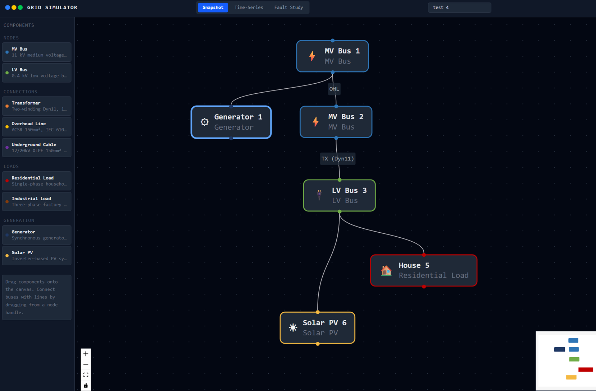
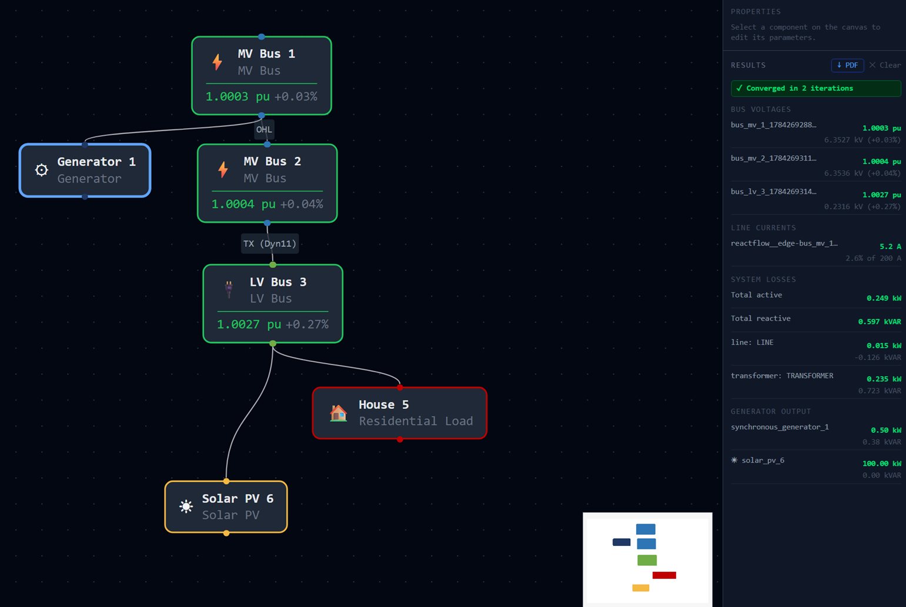
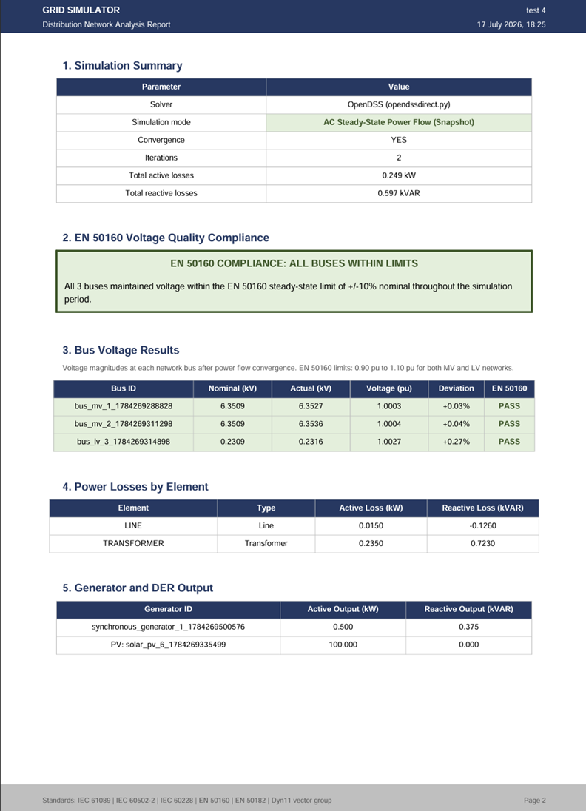

# Grid Simulator

An interactive distribution grid simulator and substation SCADA/HMI system built on **OpenDSS** with a React frontend. Draw single-line diagrams, run professional-grade power flow simulations, export engineering reports, and monitor a live substation via a real-time SCADA screen — all from a browser interface.

Built as a portfolio project by an Electrical Engineering and Computers student at UNSTPB. All components, parameters, and results follow **EU/IEC standards**.

---

## Screenshots

### Network Canvas


### Simulation Results


### Exported Engineering Report


---

## What it does

### Grid Simulator — Three simulation modes

**Snapshot — AC Power Flow**
Solves a steady-state AC power flow using the Newton-Raphson method via OpenDSS. Returns bus voltages in per-unit, line currents as a percentage of ampacity, transformer and line losses, and generator reactive output. Results are checked automatically against **EN 50160** voltage quality limits.

**Time-Series — 24-Hour Daily Simulation**
Runs 48 consecutive snapshot solves (30-minute intervals) using built-in Romanian daily load profiles and solar irradiance curves based on Bucharest's geographic coordinates (44.4°N). Supports summer and winter seasonal profiles and a configurable load multiplier. Results include voltage profiles across the day, total energy generated and lost, and EN 50160 compliance statistics across all time steps.

**Fault Study — Short-Circuit Analysis**
Calculates three-phase and single line-to-ground fault currents at every bus using the Thevenin impedance method (EN 60909 methodology). Returns fault currents in kA, Thevenin impedances (Z1 and Z0), and X/R ratios for protection relay coordination.

### SCADA/HMI Module — Live substation monitoring and control

A separate application accessible at `/scada` that provides a real-time operator interface for a fixed 11kV/0.4kV substation. The SCADA module runs independently of the Grid Simulator canvas and demonstrates industrial control system concepts distinct from power flow analysis.

**Single-Line Diagram**
SVG-based fixed-topology diagram following IEC 60617 symbol conventions. All equipment is colour-coded live: green (energised, healthy), amber (warning threshold), red (alarm or de-energised), grey (open breaker / de-energised path). Measurement tags float next to each element showing live voltage (kV and pu), current (A), and loading (%).

**Live Measurements via WebSocket**
Measurements update every 5 seconds via a persistent WebSocket connection. Two data source modes are supported: a synthetic source that generates physically plausible measurements from a 24-hour sinusoidal profile, and an OpenDSS source that runs a real power flow on every tick.

**Breaker Control with Interlock Logic**
Clicking any breaker on the diagram opens a control dialog with a two-step confirmation workflow. Before the command is sent, a frontend interlock engine evaluates switching rules and returns one of three outcomes: ALLOWED, WARNING (proceeds with operator confirmation), or BLOCKED (hard interlock — operation refused). Interlock rules include parallel source prevention, dead bus close blocking, last source warnings, and transformer isolator sequencing.

**Alarm Management**
An alarm engine evaluates every measurement against EN 50160 voltage thresholds and IEC 60076-1 transformer loading limits on every tick. Alarms have three states: ACTIVE (unacknowledged, flashing), ACKNOWLEDGED (operator has seen it), and CLEARED (condition resolved automatically). The top bar shows a live unacknowledged alarm count.

**Event Log**
Every alarm raised, acknowledged, or cleared, and every breaker operation, is recorded with a precise UTC timestamp. The event log is filterable by event type (alarms, operator actions, system).

**Historical Trends**
Recharts line charts showing bus voltage (pu) and transformer loading (%) over selectable time windows: 1 hour, 6 hours, 24 hours, 7 days. EN 50160 and IEC 60076-1 limit lines are overlaid on the charts. Data is stored in a local SQLite database with 7-day retention and automatic pruning.

---

## Technical architecture

### Grid Simulator

```
┌─────────────────────────────────────────┐
│           React Frontend                │
│   React Flow canvas  │  Zustand store   │
│   Tailwind CSS       │  Axios HTTP      │
└──────────────────────┬──────────────────┘
                       │ REST API (JSON)
┌──────────────────────▼──────────────────┐
│           FastAPI Backend               │
│   Pydantic validation                   │
│   DSS script translator                 │
│   OpenDSS solver wrapper                │
│   ReportLab PDF generator               │
└──────────────────────┬──────────────────┘
                       │ opendssdirect.py
┌──────────────────────▼──────────────────┐
│              OpenDSS Engine             │
│   AC power flow  │  Fault study         │
│   Daily mode     │  Thevenin Zsc        │
└─────────────────────────────────────────┘
```

### SCADA/HMI Module

```
┌──────────────────────────────────────────────┐
│           React Frontend (/scada)            │
│   SVG single-line diagram                    │
│   Zustand SCADA store                        │
│   WebSocket client (auto-reconnect)          │
│   Recharts trend charts                      │
└──────────────────────┬───────────────────────┘
                       │ WebSocket (push, 5s)
                       │ REST (history, events)
┌──────────────────────▼───────────────────────┐
│           FastAPI Backend (/scada/*)         │
│   SimulationLoop (asyncio background task)   │
│   AlarmEngine (EN 50160 / IEC 60076-1)       │
│   EventLog (ring buffer, 500 events)         │
│   HistoryStore (SQLite, 7-day retention)     │
│   ConnectionManager (WebSocket broadcast)    │
└──────────────────────┬───────────────────────┘
                       │
          ┌────────────┴────────────┐
          │                         │
┌─────────▼──────────┐   ┌─────────▼──────────┐
│  SyntheticData     │   │  OpenDSSData        │
│  Source            │   │  Source             │
│  (default)         │   │  (USE_OPENDSS=true) │
└────────────────────┘   └────────────────────┘
```

**Why OpenDSS instead of a custom solver?**
OpenDSS is a professional-grade distribution system simulator used by utilities, research institutions, and the US Department of Energy. Using it as the computational core — rather than implementing power flow from scratch — means the simulation results are validated and correct. The engineering contribution of this project is the data model, the DSS script translator, the EU/IEC standards compliance layer, and the frontend interface.

---

## Component library

8 components modelled to EU/IEC specifications:

| Component | Standard | Key Parameters |
|-----------|----------|---------------|
| MV Bus (11 kV) | — | Base voltage 11 kV, 3-phase |
| LV Bus (0.4 kV) | — | Base voltage 0.4 kV, 3-phase |
| Two-Winding Transformer | Dyn11 vector group | 500 kVA, 11/0.4 kV, %R=1.1, %X=4.0 |
| Overhead Line | IEC 61089 / EN 50182 | ACSR 150mm², R1=0.196 Ω/km, ampacity 415 A |
| Underground Cable | IEC 60502-2 / IEC 60228 | 12/20kV XLPE 150mm² Cu, R1=0.124 Ω/km |
| Residential Load | — | Single-phase, 5 kW default, PF 0.95 |
| Industrial Load | — | Three-phase, 250 kW default, PF 0.90 |
| Synchronous Generator | — | 500 kW, configurable kV and PF |
| Solar PV | IEC 61215 (STC) | 100 kW peak, inverter-based, PVSystem object |

---

## Standards compliance

| Standard | Governs |
|----------|---------|
| **EN 50160** | Voltage quality limits. Applied to all bus voltage results in Grid Simulator and to SCADA alarm thresholds (±6% warning, ±10% critical). |
| **IEC 61089** | Overhead conductor specifications (ACSR 150mm² impedance values). |
| **EN 50182** | Overhead conductor construction (ACSR strand geometry). |
| **IEC 60502-2** | Underground cable ratings (12/20kV XLPE construction). |
| **IEC 60228** | Conductor resistance at rated temperature (150mm² Cu at 90°C). |
| **EN 60909** | Short-circuit current calculation methodology (fault study). |
| **IEC 61215** | PV module standard test conditions (1.0 kW/m², 25°C). |
| **IEC 60076-1** | Transformer loading limits. Applied to SCADA alarm thresholds (70% warning, 90% critical). |
| **IEC 60617** | Graphical symbols for diagrams. Applied to SCADA single-line diagram symbols (breakers, transformers, busbars). |

---

## Installation

### Requirements

- Python 3.11+
- Node.js 18+

### Clone and install

```bash
git clone https://github.com/DragoiOvidiuMihai/grid-simulator.git
cd grid-simulator
```

**Backend:**
```bash
python -m venv venv

# Windows
venv\Scripts\activate
# Mac / Linux
source venv/bin/activate

pip install fastapi "uvicorn[standard]" opendssdirect.py pydantic reportlab
```

> **Note:** `uvicorn[standard]` is required (not plain `uvicorn`) — the standard extras install the `websockets` library needed for the SCADA WebSocket endpoint.

**Frontend:**
```bash
cd frontend
npm install
cd ..
```

### Run

Open two terminals from the project root:

**Terminal 1 — Backend (synthetic data, default):**
```bash
uvicorn backend.api.main:app --port 8000
```

**Terminal 1 — Backend (OpenDSS real power flow):**
```bash
# Windows PowerShell
$env:USE_OPENDSS = "true"
uvicorn backend.api.main:app --port 8000

# Mac / Linux
USE_OPENDSS=true uvicorn backend.api.main:app --port 8000
```

**Terminal 2 — Frontend:**
```bash
cd frontend
npm run dev
```

Open **http://localhost:5173** for Grid Simulator.
Open **http://localhost:5173/scada** for the SCADA/HMI module.

---

## API endpoints

### Grid Simulator

| Method | Endpoint | Description |
|--------|----------|-------------|
| `GET` | `/health` | Server health check |
| `POST` | `/simulate` | AC snapshot power flow |
| `POST` | `/simulate-timeseries` | 24-hour time-series simulation |
| `POST` | `/fault-study` | Short-circuit fault study |
| `POST` | `/export-pdf` | Generate PDF report |
| `POST` | `/preview-dss` | Preview raw DSS script (development) |

### SCADA/HMI Module

| Method | Endpoint | Description |
|--------|----------|-------------|
| `GET` | `/scada/health` | SCADA module status, data source, WebSocket client count |
| `GET` | `/scada/state` | Latest measurement snapshot (REST fallback) |
| `GET` | `/scada/alarms` | Current active and acknowledged alarms |
| `GET` | `/scada/events` | Recent event log entries (newest first) |
| `GET` | `/scada/history` | Historical trend data (`?window=1h&metric=voltage`) |
| `GET` | `/scada/history/stats` | SQLite row counts (diagnostics) |
| `WS` | `/scada/ws` | WebSocket: live state updates and breaker/alarm commands |

Interactive API documentation available at **http://localhost:8000/docs** when the backend is running.

---

## Project structure

```
grid-simulator/
├── backend/
│   ├── api/
│   │   ├── main.py                     # FastAPI app, lifespan, CORS
│   │   ├── report_generator.py         # ReportLab PDF generator
│   │   └── scada_router.py             # SCADA REST + WebSocket endpoints
│   ├── models/
│   │   └── models.py                   # Pydantic data models (8 components)
│   ├── translators/
│   │   ├── dss_translator.py           # Grid → DSS script (snapshot)
│   │   └── dss_translator_timeseries.py # Grid → DSS script (time-series)
│   ├── solver/
│   │   ├── solver.py                   # OpenDSS snapshot wrapper
│   │   ├── solver_timeseries.py        # OpenDSS time-series wrapper
│   │   ├── solver_fault.py             # OpenDSS fault study wrapper
│   │   └── profiles.py                 # Romanian load/irradiance profiles
│   └── scada/
│       ├── data_source.py              # DataSource abstraction + Synthetic + OpenDSS
│       ├── simulation_loop.py          # Background asyncio task, WebSocket broadcast
│       ├── alarm_engine.py             # Threshold evaluation, alarm lifecycle
│       ├── event_log.py                # Timestamped event ring buffer
│       └── history_store.py            # SQLite time-series persistence
├── frontend/
│   └── src/
│       ├── App.jsx                     # Grid Simulator root
│       ├── main.jsx                    # Router (/ and /scada)
│       ├── store/
│       │   └── gridStore.js            # Zustand state (Grid Simulator)
│       ├── components/                 # Grid Simulator UI components
│       │   ├── canvas/
│       │   ├── sidebar/
│       │   ├── properties/
│       │   ├── results/
│       │   └── SaveLoadPanel.jsx
│       └── scada/                      # SCADA/HMI module (self-contained)
│           ├── ScadaApp.jsx            # SCADA root component
│           ├── store/
│           │   └── scadaStore.js       # Zustand state (SCADA)
│           ├── hooks/
│           │   └── useWebSocket.js     # WebSocket lifecycle + reconnect
│           └── components/
│               ├── sld/                # Single-line diagram (SVG)
│               ├── controls/           # Breaker dialog + interlock engine
│               ├── alarms/             # Alarm panel + ACK workflow
│               ├── events/             # Event log table
│               └── trends/             # Historical charts (Recharts)
├── USER_GUIDE.md
├── TECHNICAL.md
├── STANDARDS.md
└── README.md
```

---

## Documentation

| Document | Contents |
|----------|----------|
| [USER_GUIDE.md](USER_GUIDE.md) | Installation, circuit-building rules, simulation modes, SCADA operation, worked examples |
| [TECHNICAL.md](TECHNICAL.md) | Architecture decisions, data model, DSS translator, SCADA backend design, WebSocket protocol |
| [STANDARDS.md](STANDARDS.md) | IEC/EN standards reference with parameter sources for both Grid Simulator and SCADA |

---

## Known limitations

- **Component variety** — the Grid Simulator library is intentionally focused: one transformer type, one overhead conductor, one cable type. This ensures every component is modelled correctly rather than offering many loosely parameterised options.
- **Single voltage level** — the network operates at 11 kV / 0.4 kV (EU standard distribution). HV transmission and other voltage levels are not modelled.
- **Balanced three-phase** — the power flow assumes balanced three-phase conditions. Unbalanced analysis is not implemented.
- **Browser localStorage** — Grid Simulator saved grids are stored in the browser and do not persist across different browsers or computers without manual transfer.
- **SCADA topology is fixed** — the SCADA module models a specific 11kV/0.4kV substation with a fixed set of equipment. The topology cannot be edited through the UI.
- **SCADA history is local** — the SQLite history database is stored locally at `backend/scada/scada_history.db` and is not shared across installations.

---

## Built with

**Backend:** Python, FastAPI, Pydantic, OpenDSSDirect.py, ReportLab, SQLite

**Frontend:** React, React Flow, Recharts, Zustand, Tailwind CSS, Vite, Axios

**Solver:** OpenDSS (via opendssdirect.py)

---

## Author

**Dragoi Ovidiu Mihai**
Electrical Engineering and Computers Student
[GitHub](https://github.com/DragoiOvidiuMihai)
